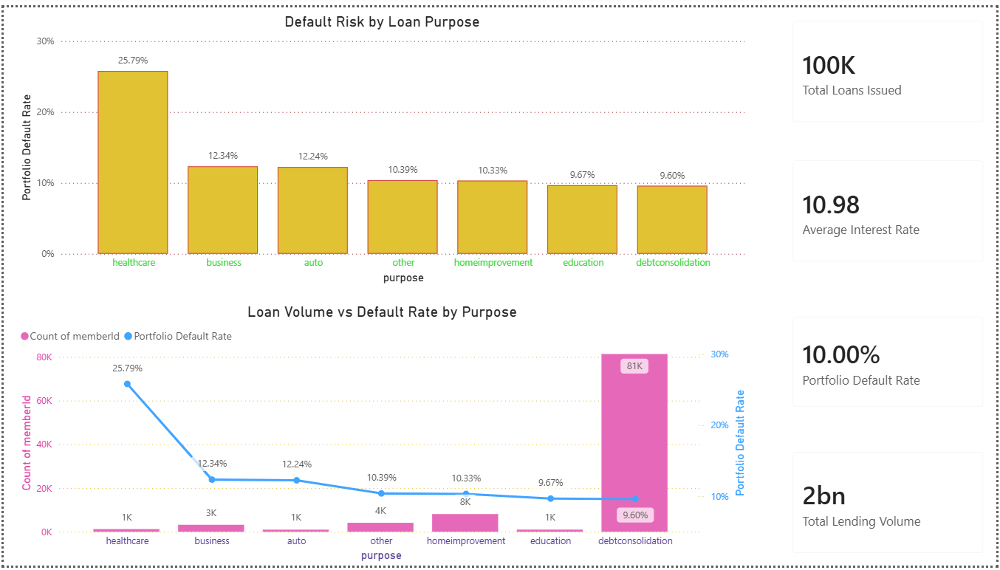
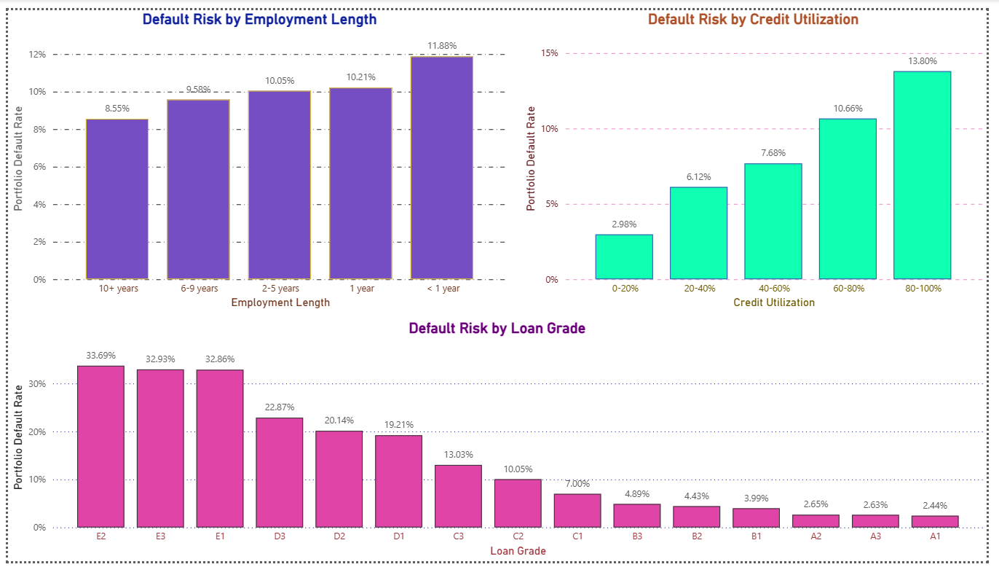

# Bank Loan Risk Analysis Project

## Project Overview

This project analyzes a bank loan portfolio to understand lending patterns, identify high-risk borrowers, and uncover factors that influence loan defaults. The analysis was completed using Python, MySQL, and Power BI to demonstrate an end-to-end data analytics workflow.

The goal of the project is to help a bank make better lending decisions by identifying manageable risks while maintaining a healthy loan portfolio.

---

## Project Objectives

* Analyze the overall loan portfolio.
* Identify factors that contribute to loan defaults.
* Compare default rates across different borrower segments.
* Build an interactive Power BI dashboard for business users.
* Demonstrate an end-to-end data analytics workflow using Python, SQL, and Power BI.

---

# Project Workflow

### Step 1 – Data Collection

The project started with raw borrower and loan datasets provided in text format.

The raw files were converted into CSV format using a Python script before analysis.

---

### Step 2 – Data Preparation (Python)

Python was used to prepare the data for analysis.

Tasks completed include:

* Loading datasets
* Converting TXT files into CSV
* Data quality checks
* Handling missing values
* Cleaning inconsistent records
* Exploratory Data Analysis (EDA)
* Creating visualizations using Matplotlib
* Selecting the most meaningful business insights

Several exploratory analyses were performed before selecting the final business insights used throughout the project.

---

### Step 3 – SQL Analysis

After cleaning the data, MySQL was used to perform business analysis.

SQL tasks include:

* Creating the database schema
* Importing cleaned datasets
* Writing analytical queries
* Calculating KPIs
* Identifying lending trends
* Measuring default rates
* Preparing business metrics for reporting

---

### Step 4 – Dashboard Development

The cleaned data and SQL insights were imported into Power BI.

The dashboard focuses on helping decision makers quickly understand portfolio performance and loan risk.

Two dashboard pages were created:

### Executive Overview

Provides a high-level summary of the loan portfolio, including:

* Total Loans Issued
* Total Lending Volume
* Average Interest Rate
* Portfolio Default Rate
* Default Rate by Loan Purpose
* Loan Distribution by Purpose

---

### Risk Analysis

Focuses on identifying risky borrower segments by analyzing:

* Default Rate by Employment Length
* Default Rate by Credit Utilization
* Default Rate by Loan Grade

These visuals help identify which borrower groups require additional attention during loan approval.

---

# Dashboard Preview

## Executive Overview

.

---

## Risk Analysis



---

# Technologies Used

* Python
* Pandas
* NumPy
* Matplotlib
* MySQL
* Power BI
* Git
* GitHub

---

# Project Structure

```text
Bank_project/

│
├── data/
│   ├── borrower.txt
│   ├── loan.txt
│   ├── borrower.csv
│   ├── loan.csv
│   └── merged_loan_data.csv
│
├── python/
│   ├── txt_to_csv_converter.py
│   ├── 01_data_loading.py
│   ├── 02_data_cleaning.py
│   ├── 03_eda.py
│   ├── 03_eda2.py
│   ├── 04_data_visualization.py
│   └── data_quality_checks.py
│
├── sql/
│   ├── schema.sql
│   └── bank_loan_queries.sql
│
├── powerbi/
│   └── bank_loan_risk_analysis.pbix
│
├── images/
│   ├── Executive_Overview_dashboard_image.png
│   ├── Risk_Analysis_dashboard_image.png
│   ├── default_rate_by_employment.png
│   ├── default_rate_by_grade.png
│   ├── default_rate_by_purpose.png
│   ├── default_rate_by_utilization.png
│   └── loan_count_by_purpose.png
│
└── README.md
```

---

# Key Business Insights

* Healthcare loans have the highest default rate among all loan purposes.
* Borrowers with less than one year of employment show the highest default rate.
* Default risk increases as credit utilization increases.
* Lower loan grades are significantly more likely to default.
* Debt Consolidation accounts for the largest share of issued loans.

---

# Dataset

The dataset used in this project was obtained for educational and portfolio development purposes.

Dataset Source:https://microsoft.github.io/r-server-loan-credit-risk/input_data.html


---

# Learning Outcomes

This project helped strengthen my skills in:

* Data Cleaning
* Exploratory Data Analysis
* SQL Query Writing
* Business KPI Analysis
* Power BI Dashboard Development
* Git and GitHub
* End-to-End Data Analytics Workflow

---

# Author

VARADHARAJU D

Aspiring Data Analyst

GitHub:
https://github.com/varadhapraveen18-DA

